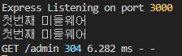
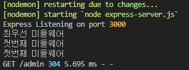

## 미들웨어

---

참고: http://expressjs.com/ko/guide/writing-middleware.html

**<참고파일>**

1. express-server.js
2. routes/Admin.js

- 클라이언트와 서버 간의 통신 담당 or 컴퓨터와 컴퓨터를 연결을 담당하는 시스템 소프트웨어... 서비스마다 그 의미 다양
- Node.js에서 미들웨어는 최종 요청 핸들러 이전의 Express 라우팅 계층에 의해 호출되는 함수로, 원시 요청과 의도된 최종 라우트 사이의 미들웨어에 위치한다.
  ;

- 예) URL 변동 시 로그인을 체크해야되는 경우
  - 일부 URL에서 로그인을 요구할 경우, 로그인이 안되어 있을 때 로그인 페이지로 강제 이동함.
- 수행 기능
  1. 모든 코드를 실행
  2. 요청 및 응답 오브젝트에 대한 변경을 실행
  3. 요청-응답 주기를 종료
  4. 스택 내의 그 다음 미들웨어를 호출

### Morgan

---

- 콘솔에서 사용자가 어떤 url에 접속했는지 확인할 수 있음.

npm install morgan

```javascript
const logger = require("morgan");

app.use(logger("dev"));
// ex) GET / admin 304 5.695 ms - -

app.use(logger("short"));
app.use(logger("common"));
app.use(logger("tiny"));
app.use(logger("combined"));
// 더 자세한 로그 출력

//...
```

- express-server의 `use.app` 의 use도 일종의 미들웨어

## 미들웨어 사용

---

- 미들웨어는 3가지 인자 (req, res, next)를 사용함.
- next는 미들웨어 이후 과정을 진행하라는 의미.
- 여러개의 미들웨어를 한번에 사용할 수 있음.
  - 결과  
    
- app.use를 통한 전역 처리 스택에 미들웨어 추가
  ```javascript
  function primeMiddleware(req, res, next) {
  	console.log("최우선 미들웨어");
  	next();
  }
  app.use("/admin", primeMiddleware, admin);
  // admin에 위의 두가지 미들웨어가 이미 존재한다고 가정
  ```
  - 결과  
    
